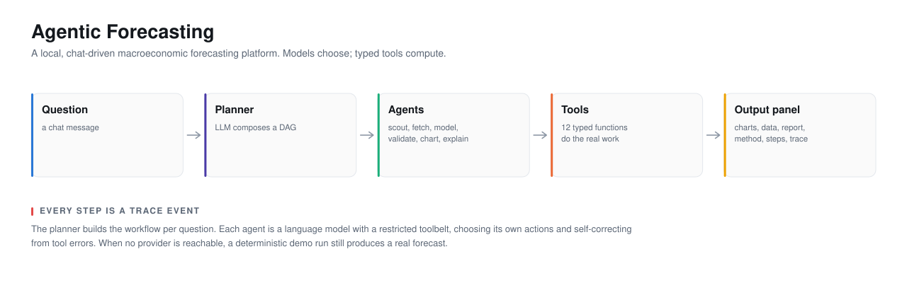
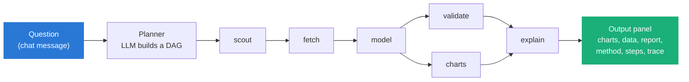

<picture>
  <source media="(prefers-color-scheme: dark)" srcset="docs/assets/hero-readme-dark.svg">
  <source media="(prefers-color-scheme: light)" srcset="docs/assets/hero-readme-light.svg">
  
</picture>

# Agentic Forecasting

A local, chat-driven macroeconomic forecasting platform. Ask a forecasting
question in a project chat. A planner composes a team of agents that pick the
data, pull it from official sources, run econometric models, render charts, and
explain the method. Every number comes from a tool, and every step is a
recorded event.

## The problem

Ask a good language model for the beta of Apple against the S&P 500. It will
give you a number. It will be formatted like a beta, it will be in a plausible
range, and it will be delivered in the same tone as a correct answer. Sometimes
it will even be right.

That is the problem. A forecast you cannot trace is a guess with a confidence
interval drawn on afterward. This project has watched its own agents fail in
exactly this shape. A real run in its history was asked how the GBP/INR
exchange rate had changed over twenty years and replied, in full prose, that it
could not draw charts and here was some Python to run yourself. No data was
fetched. No chart was drawn. The answer read as authoritative and was empty.

The failures cluster into three kinds, and each has a different remedy. A model
that invents a statistic. A model that cannot see what a prior step produced, so
it guesses. A data source that returns plausible filler instead of admitting no
match. [docs/1-why](docs/1-why/) lays out all three with the trace output behind
each.

## The answer

The model selects; it never computes. A planner language model turns a question
into a workflow DAG of specialist agents. Each agent is a language model with a
restricted toolbelt, and it acts only by naming a tool and its arguments in
JSON. A typed Python function does the arithmetic, fetches the series, or fits
the model. The prose an agent writes is checked against what the tools actually
returned.

This is why the whole system turns on one decision: tool calls are a JSON text
protocol, not a provider's native function-calling API. Five providers behave
identically, and a deterministic demo provider can stand in when none is
reachable and still produce a real forecast. The cost is that the protocol is
looser than a typed API, so a node can emit a malformed action; the parser is
built to tolerate that, and a repeated identical failure aborts the node.
[docs/4-decisions](docs/4-decisions/) records the trade in full.



## Documentation

| # | Section | For | Answers |
|---|---|---|---|
| 1 | [Why](docs/1-why/) | Anyone deciding whether to look | What goes wrong, and why a product rather than a prompt |
| 2 | [Product](docs/2-product/) | Product owners, new users | What it does, what it guarantees, what it refuses |
| 3 | [Architecture](docs/3-architecture/) | Engineers | The layers, the seams, and the hard-won constraints |
| 4 | [Decisions](docs/4-decisions/) | Engineers, reviewers | Why it is built this way, and what would reverse each choice |
| 5 | [Roadmap](docs/5-roadmap/) | Contributors, planners | What ships next, and what is a bet |
| 6 | [Art of the possible](docs/6-art-of-the-possible/) | The curious | What the pattern makes reachable |

Start at [docs/](docs/) for the three-paragraph version and the sources of
truth.

## Status

Version 0.1.0. Runs locally, offline-capable. The test suite is 197 backend
tests (all offline) and 7 frontend store tests. Backend is 6,278 lines of
Python, frontend is 3,060 lines of TypeScript. The counts in this file come
from commands you can re-run; see [docs/2-product/capabilities.md](docs/2-product/capabilities.md).

<details>
<summary><strong>What works today</strong></summary>

- **Dynamic agent workflows.** A planner LLM composes a run-specific DAG from
  six specialist roles (data scout, fetcher, modeler, validator, chart builder,
  explainer). An executor runs it and streams every step to the UI over SSE.
- **Real data.** 11 wired connectors: FRED, World Bank, IMF, BLS, ECB, OECD,
  DBnomics (80+ upstream providers), US Treasury Fiscal Data, EIA, FAOSTAT,
  Alpha Vantage. A 45-source catalog in 7 categories accepts API keys in
  Settings and activates connectors as they ship. Responses cache in SQLite for
  24 hours, with retries.
- **Econometrics and ML.** 8 models: auto-order ARIMA, ETS, Theta, gradient
  boosting, Monte Carlo bootstrap, an ensemble, VAR, and bridge nowcasting.
  Each is backtested against a naive baseline so the explanation is honest.
- **Charts.** 9 kinds: fan charts with confidence bands, model-comparison
  overlays, trend/seasonal decompositions, change distributions, correlation
  heatmaps, indicator panels, backtest comparisons, Nelson-Siegel yield curves,
  and data tables.
- **The output panel.** Six tabs: Charts, Data, Report, Method, Steps, Trace.
  Charts and tables are numbered as figures, the report cites them inline, and
  the Steps tab shows the DAG with editable, rerunnable instructions.
- **Memory.** 4 types (short-term chat context, episodic run history, semantic
  facts with retrieval, procedural workflow templates), persisted long-term in
  SQLite. Pluggable backends with Mem0 and Zep adapters, plus connect stubs for
  8 more services.
- **LLM providers.** Anthropic, OpenAI, Gemini, NVIDIA NIM, and local Ollama,
  in an ordered fallback chain, with a deterministic demo mode when nothing is
  configured.
- **Telemetry.** Every action and decision is an event with trace and span ids.
  A per-project dashboard tracks tokens, estimated cost, and CPU/RAM/GPU during
  runs.

</details>

<details>
<summary><strong>What it will not do</strong></summary>

- **Let a model write a number that no tool computed.** The report's figures
  come from the tool results. This is the point of the whole design.
- **Run a chart the data cannot support without saying why.** A chart builder
  call for a series that was never fetched fails with the list of series that
  do exist, and the failure is the useful signal.
- **Invent a data match.** A search that finds nothing returns nothing, not the
  head of a catalog. See [docs/1-why/what-goes-wrong.md](docs/1-why/what-goes-wrong.md).
- **Forecast when you asked what already happened.** A retrospective question
  gets a describe-and-chart workflow with no modeling step.
- **Give financial advice.** Forecasts are statistical estimates with stated
  uncertainty. Nothing here is investment advice.
- **Call a provider's native tool-use API.** Tools are a JSON text protocol so
  every provider behaves identically. See [docs/4-decisions](docs/4-decisions/).

</details>

## Quickstart

Prerequisites: Python 3.12+, Node 20+. No API keys are required; with none, the
app tries local Ollama and then a deterministic demo workflow that produces a
real ARIMA forecast from World Bank data.

Backend:

```powershell
cd backend
python -m venv .venv
.venv\Scripts\python -m pip install fastapi "uvicorn[standard]" sqlalchemy pydantic pydantic-settings httpx pandas numpy statsmodels scikit-learn anthropic openai google-genai ddgs psutil nvidia-ml-py python-dotenv pytest sse-starlette mcp
copy .env.example .env
```

Frontend:

```powershell
cd frontend
npm install
```

Run both:

```powershell
scripts\dev.ps1
```

Open http://localhost:5173, create a project, open a chat, and ask something
like "Nowcast US GDP growth for the current quarter" or "How has UK
unemployment changed over the last 20 years".

Keys are optional and go in **Settings, Data sources** (stored in SQLite,
masked) or in `backend/.env`. The full table is in
[docs/2-product/README.md](docs/2-product/README.md).

## Tests

```powershell
cd backend; .venv\Scripts\python -m pytest      # 197 tests, all offline
cd frontend; npx vitest run                      # 7 store tests
```

## Layout

```
frontend/  React + Vite + TypeScript + Tailwind + Plotly
backend/   FastAPI + SQLAlchemy (SQLite) + SSE
  app/agents/engine   planner, executor, event bus, resource sampler
  app/agents/tools    the 12 agent tools
  app/connectors      11 data-source connectors, cache, catalog
  app/forecasting     the 8 models, backtesting, series helpers
  app/llm             provider adapters and the fallback registry
  app/memory          4-type memory, SQLite backend, Mem0/Zep adapters
  app/routers         projects, chats, chat pipeline, telemetry, settings, files
docs/      the six documentation sections and the diagram generators
```

## Contributing

There is no formal process yet. The architecture that a change has to respect
is in [docs/3-architecture](docs/3-architecture/), and the decisions it should
not silently undo are in [docs/4-decisions](docs/4-decisions/). Both test
suites must pass.

## Licence

No licence file is present. Treat the code as all-rights-reserved until one is
added.

## Acknowledgements

This project stands on generously provided public data and open-source
software. All data is fetched live from providers' public APIs and remains
subject to their terms of use.

**Data providers.** Federal Reserve Bank of St. Louis (this product uses the
FRED API but is not endorsed or certified by the Bank), The World Bank
(Indicators API, CC BY 4.0), International Monetary Fund, OECD, European Central
Bank, U.S. Bureau of Labor Statistics, U.S. Department of the Treasury (Fiscal
Data), U.S. Energy Information Administration, FAO (FAOSTAT, CC BY 4.0),
DBnomics (Cepremap), and Alpha Vantage.

**Open-source software.** FastAPI, Starlette, SQLAlchemy, pydantic, pandas,
NumPy, statsmodels, scikit-learn, httpx, sse-starlette, psutil, ddgs, the Model
Context Protocol SDK; React, Vite, TypeScript, Tailwind CSS, Plotly.js,
react-plotly.js, Zustand, react-markdown.

**LLM providers and SDKs.** Anthropic (Claude), OpenAI, Google (Gemini), NVIDIA
(NIM), and Ollama.

**Disclaimer.** This software is for research and educational purposes.
Forecasts are statistical estimates with uncertainty. Nothing produced by this
application is financial or investment advice.
