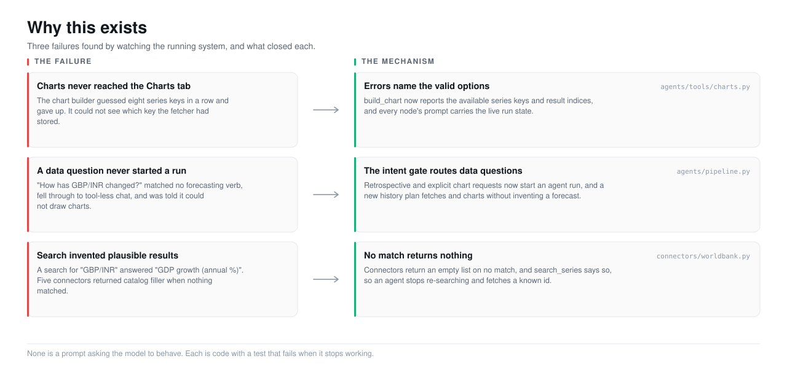
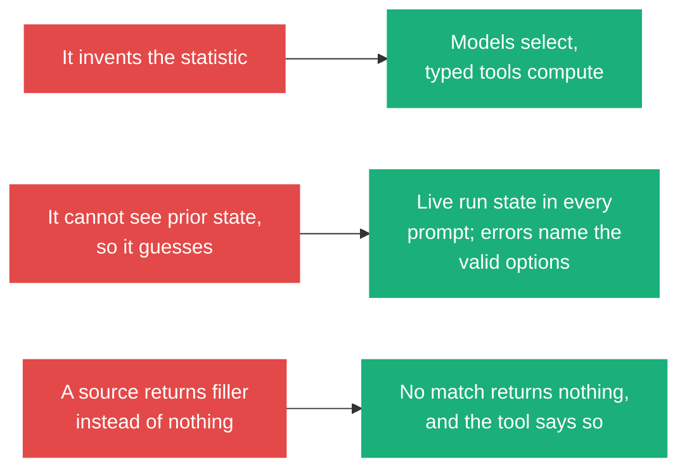

<picture>
  <source media="(prefers-color-scheme: dark)" srcset="../assets/hero-why-dark.svg">
  <source media="(prefers-color-scheme: light)" srcset="../assets/hero-why-light.svg">
  
</picture>

# Why this exists

## The thing that is actually wrong

A language model asked for a number produces one. Ask for the beta of a stock,
the persistence of a volatility process, the probability of a sovereign default,
and it returns a figure formatted like the real thing, in a plausible range,
delivered in the tone of a correct answer. There is no marker on the output that
separates the times it computed something from the times it pattern-matched a
number that looks right.

This is worse than an error, because it is intermittent. An error you can catch.
A number that is right most of the time and confidently wrong sometimes defeats
spot-checking: the spot check passes, and the wrong ones ship. A forecast you
cannot trace back to the observation it came from is not a forecast. It is a
guess wearing a confidence interval.

## The trap

The obvious fix is to ask the model to behave. Add to the prompt: "only use real
data", "show your work", "do not make up numbers". This does not work, and the
reason it does not work is instructive. The model is not lying. It has no access
to the distinction. Told to show its work, it writes plausible work. Told to use
real data, it writes a real-looking series. The instruction and the failure live
in the same medium, so the instruction cannot constrain the failure.

This project has the evidence in its own history. Even with the pipeline built,
a real run was asked how the GBP/INR exchange rate had changed over twenty years.
The model replied that it could not draw charts in a chat interface, and offered
a block of matplotlib to run yourself. It was fluent, structured, and completely
disconnected from the data the platform exists to fetch. Prompting was not the
missing piece.

## The failures, separated

The failures are not one problem. They are three, and each needs a different
mechanism. [what-goes-wrong.md](what-goes-wrong.md) has the trace output behind
each.

**It invents the statistic.** The remedy is that the model never does
arithmetic. It names a tool from a registry of typed functions, and the function
computes. The model's job is selection, not calculation. This is the central
decision, and everything else follows from it.

**It cannot see what a prior step produced, so it guesses.** In a real run, the
chart builder tried to plot a series and guessed eight different keys for it
(`uk_unemployment_rate`, `UNRATE`, `MGSX`, and more), because the tool error was
a bare `KeyError` that named none of the keys that did exist. The fix is two
parts: every tool error names the valid options, and every agent's prompt
carries the live run state (which series were fetched, which models ran, which
figures exist).

**A data source returns plausible filler instead of admitting no match.** A
search for "GBP/INR" returned "GDP growth (annual %)", because five connectors
answered an empty match with the head of their catalog. An agent cannot tell
filler from a hit, so it kept re-searching and never fetched. The fix is that a
search with no match returns nothing, and the tool says so.

## Why a product, not a prompt

Each remedy is a mechanism with a test, not an instruction with a hope.

- "Models select, tools compute" is enforced by the tool layer: an agent has no
  way to return a number except through a function that computed it.
- "Errors name the valid options" is a property of every tool's failure path,
  checked by tests that assert the error text contains the available keys.
- "No match returns nothing" is a property of every connector, checked by a test
  that a search for a nonsense term returns an empty list.

None of these can be un-done by a model having a bad day, because none of them is
a request to the model. That is the difference between a product and a prompt: a
prompt asks, and a product removes the ability to get it wrong.

## Why this domain

Macroeconomic forecasting is a good place to build this because the ground truth
is unusually available and unusually cheap. The series are public and free (FRED,
World Bank, the IMF). The models are standard and have honest baselines: a naive
last-value forecast is a real competitor, so "does this method beat doing
nothing" is a question with a number for an answer. And the failure mode is
visible: a Gini coefficient outside [0, 1], a forecast that cannot beat the
baseline, a chart of a series that was never fetched. The domain punishes the
invented number, which makes it a good place to prove the invented number can be
designed out.

## What this buys you

Stated narrowly enough to be falsifiable: **you can get from any number in the
report back to the raw observation it came from, using only the output panel.**
The Report cites a figure, the figure is a chart or table of a named series, the
Method tab names the series' source and date range, and the Trace tab holds the
exact tool call that fetched it. If a number in the report cannot be walked back
to a tool result this way, that is a bug, and it is the specific bug this project
exists to prevent.

---

Sections: [Index](../) · **1 Why** · [2 Product](../2-product/) ·
[3 Architecture](../3-architecture/) · [4 Decisions](../4-decisions/) ·
[5 Roadmap](../5-roadmap/) · [6 Art of the possible](../6-art-of-the-possible/)

In this section: **Why** · [What goes wrong](what-goes-wrong.md)
