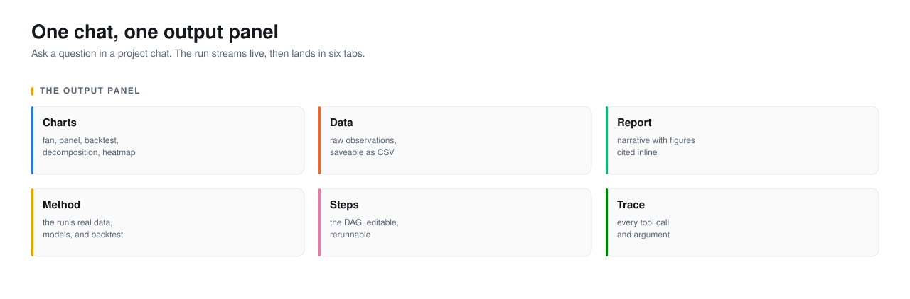
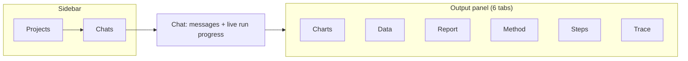
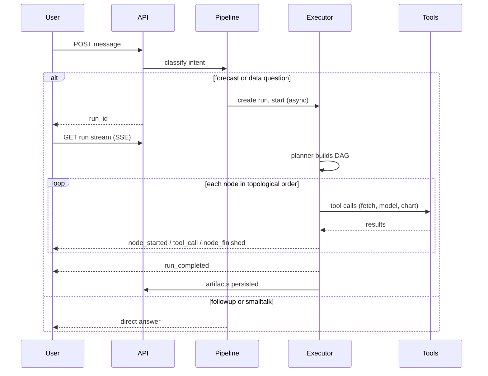

<picture>
  <source media="(prefers-color-scheme: dark)" srcset="../assets/hero-product-dark.svg">
  <source media="(prefers-color-scheme: light)" srcset="../assets/hero-product-light.svg">
  
</picture>

# Product

Ask a forecasting question in a project chat. The run streams live, then lands
in an output panel of six tabs. That is the whole surface. This page covers the
shape, the loop, and the guarantees. The complete enumeration of tools, models,
connectors, and formats is in [capabilities.md](capabilities.md); the
requirements and personas are in [prd.md](prd.md); worked sessions, including
one where the product refuses, are in [journeys.md](journeys.md).

## The shape

Projects hold chats; chats hold messages and runs. A run is one forecasting
question and everything the agents did to answer it. The output panel shows one
run at a time.

## The loop

The user posts a message. The pipeline classifies it. A forecast or data
question creates a run and returns its id immediately; the browser then opens a
Server-Sent Events stream and watches the workflow execute node by node. A
follow-up ("why did you pick ARIMA") or smalltalk is answered directly without a
run. The full intent gate is in [prd.md](prd.md#fr-intent).

## The guarantees

Each is a mechanism with a test behind it, not an aspiration.

| Guarantee | Mechanism | Test |
|---|---|---|
| Every reported number came from a tool | Agents act only by naming a tool; typed functions compute | `tests/test_tools.py`, `tests/test_run_wiring.py` |
| A model is backtested against a naive baseline | `run_model` computes and returns backtest RMSE/MAPE | `tests/test_forecasting_basics.py`, `tests/test_models_suite.py` |
| The report cites the charts it describes | A figure index is appended to every report; the Report tab renders figures inline | `tests/test_run_wiring.py` |
| A chart of an unfetched series fails loudly | `build_chart` errors name the available keys | `tests/test_chart_recovery.py` |
| A search that matches nothing returns nothing | Connectors return an empty list, not filler | `tests/test_search_honesty.py` |
| A run is replayable and editable | The plan is stored; `rerun` replays it, optionally with edits | `tests/test_orchestrator.py` |
| It works with no API keys | Provider chain falls back to a deterministic demo run | `tests/test_demo_llm.py` |

## What it will not do

| Refusal | Why |
|---|---|
| Write a number no tool computed | The point of the design; see [Why](../1-why/) |
| Forecast a retrospective question | "How has X changed" gets a describe-and-chart plan, no model |
| Return a data match it does not have | Filler is worse than nothing; the agent cannot tell them apart |
| Give investment advice | Forecasts are estimates with uncertainty, not advice |
| Use a provider's native tool API | Tools are a JSON text protocol so providers behave identically |
| Persist a secret to the repo | Keys live in SQLite or `.env`, both gitignored |

## Status

| Area | State |
|---|---|
| Agent workflows | Working. Planner LLM or template fallback, 6 roles, 12 tools |
| Data connectors | 11 wired and tested; 45-source catalog accepts keys ahead of connectors |
| Models | 8, each backtested |
| Charts | 9 kinds |
| Output panel | 6 tabs; figures numbered and cited; Steps tab reruns |
| Memory | 4 types on SQLite; Mem0 and Zep adapters; 8 connect stubs |
| Providers | 5 (Anthropic, OpenAI, Gemini, NVIDIA, Ollama) plus demo fallback |
| Tests | 197 backend (offline), 7 frontend |
| Packaging | Local dev only; no container or deploy target yet |

---

Sections: [Index](../) · [1 Why](../1-why/) · **2 Product** ·
[3 Architecture](../3-architecture/) · [4 Decisions](../4-decisions/) ·
[5 Roadmap](../5-roadmap/) · [6 Art of the possible](../6-art-of-the-possible/)

In this section: **Product** · [PRD](prd.md) · [Capabilities](capabilities.md) ·
[Journeys](journeys.md)
