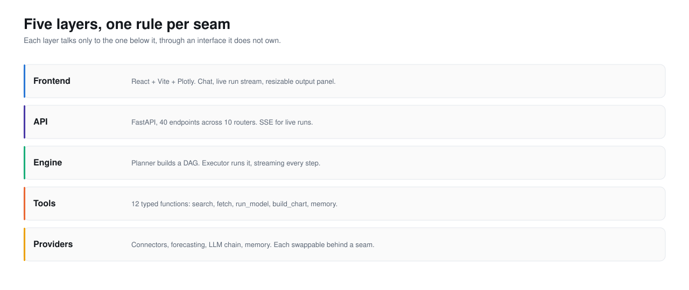
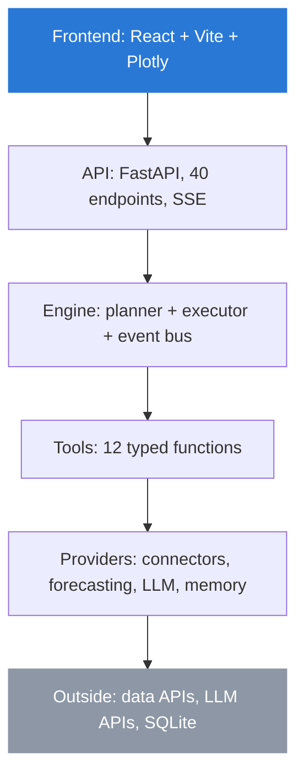

<picture>
  <source media="(prefers-color-scheme: dark)" srcset="../assets/hero-architecture-dark.svg">
  <source media="(prefers-color-scheme: light)" srcset="../assets/hero-architecture-light.svg">
  
</picture>

# Architecture

## The rule that generates it

One rule shapes the whole backend: **the model selects, and typed code
computes.** Everything an agent can do, it does by naming a tool. Every tool is
a typed Python function. So the architecture is a funnel: a language model at
the top making decisions, and a widening set of deterministic functions below it
doing the work, each behind an interface the layer above does not own.

That gives the layers, top to bottom.

## The seams

A seam is an interface where one side can be swapped without the other noticing.
The system has five that matter.

| Seam | Interface | What it lets you swap |
|---|---|---|
| Tool | `ToolSpec` (name, schema, fn) | Add a tool without touching the executor |
| Connector | `Connector` protocol (`search`, `fetch`) | Add a data source without touching the tools |
| Model | `run_model(name, ...)` dispatch | Add a forecasting model without touching the agent |
| Provider | `LLMAdapter` (`complete`) | Add an LLM without touching the pipeline |
| Memory | memory backend interface | Swap SQLite for Mem0 or Zep without touching the service |

Each seam is why a whole category of change is local. A new connector is one
file plus a registry line; it cannot break the executor, because the executor
never sees a connector, only a tool that uses one.
[integration-patterns.md](integration-patterns.md) walks each boundary.

## Where the complexity is

If you read five files before anything else, read these.

1. [`agents/engine/executor.py`](../../backend/app/agents/engine/executor.py):
   runs the DAG, streams events, injects run state into prompts, aborts on
   repeated failure. This is the heart.
2. [`agents/engine/planner.py`](../../backend/app/agents/engine/planner.py):
   question to DAG, with a template fallback and the tolerant JSON action
   parser every provider relies on.
3. [`agents/tools/charts.py`](../../backend/app/agents/tools/charts.py): the
   chart builders, and the error-message design that lets an agent recover.
4. [`llm/registry.py`](../../backend/app/llm/registry.py): the provider chain,
   the token ledger, and the cost estimate.
5. [`connectors/cache.py`](../../backend/app/connectors/cache.py) plus
   [`connectors/base.py`](../../backend/app/connectors/base.py): the retry and
   cache wrapper every connector sits behind.

The rest is covered module by module in
[low-level-design.md](low-level-design.md), with the non-obvious constraints
called out.

## What the architecture refuses

- **No tool call reaches a provider's native function-calling API.** Tools are a
  JSON text protocol. This is the seam that keeps five providers identical, and
  it is deliberate; see [Decisions](../4-decisions/).
- **No agent computes.** An agent that wants arithmetic must call a tool. There
  is no path from a model's text to a reported number that skips a function.
- **No layer reaches past the one below it.** The frontend does not call a
  connector; it calls the API, which calls the engine, which calls a tool. This
  is what makes the seams real rather than decorative.
- **No secret in the repo.** Keys live in the `app_settings` table or `.env`.

For the full picture: [high-level-design.md](high-level-design.md) for the
context, components, and data flow; [blueprints.md](blueprints.md) for the
reference drawings; [integration-patterns.md](integration-patterns.md) for the
boundaries.

---

Sections: [Index](../) · [1 Why](../1-why/) · [2 Product](../2-product/) ·
**3 Architecture** · [4 Decisions](../4-decisions/) · [5 Roadmap](../5-roadmap/) ·
[6 Art of the possible](../6-art-of-the-possible/)

In this section: **Architecture** · [High-level design](high-level-design.md) ·
[Low-level design](low-level-design.md) · [Blueprints](blueprints.md) ·
[Integration patterns](integration-patterns.md)
