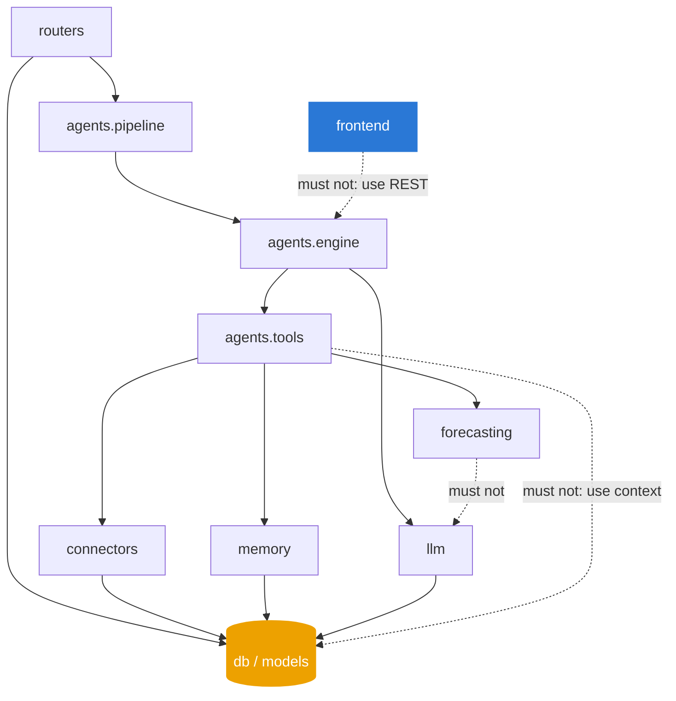
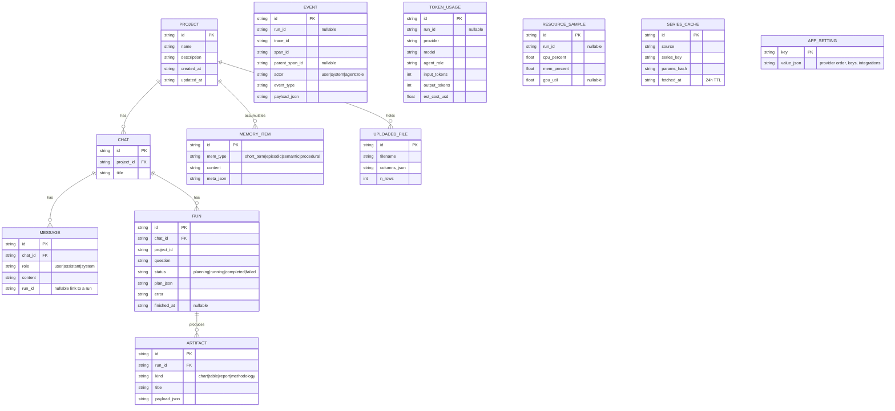
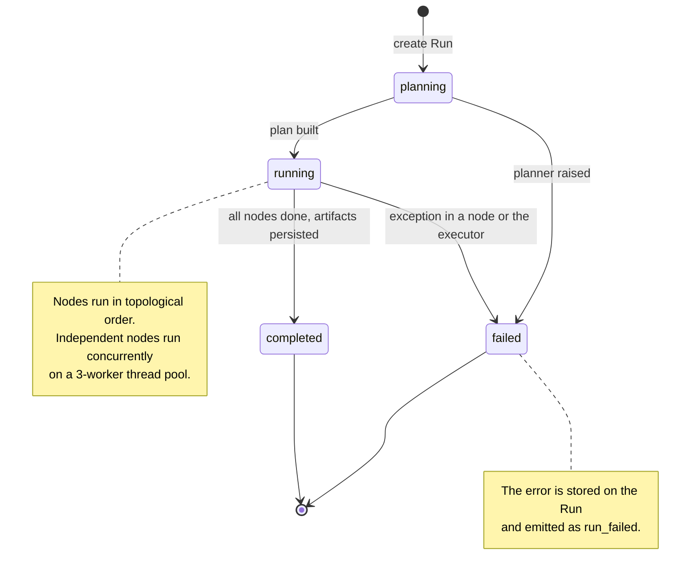
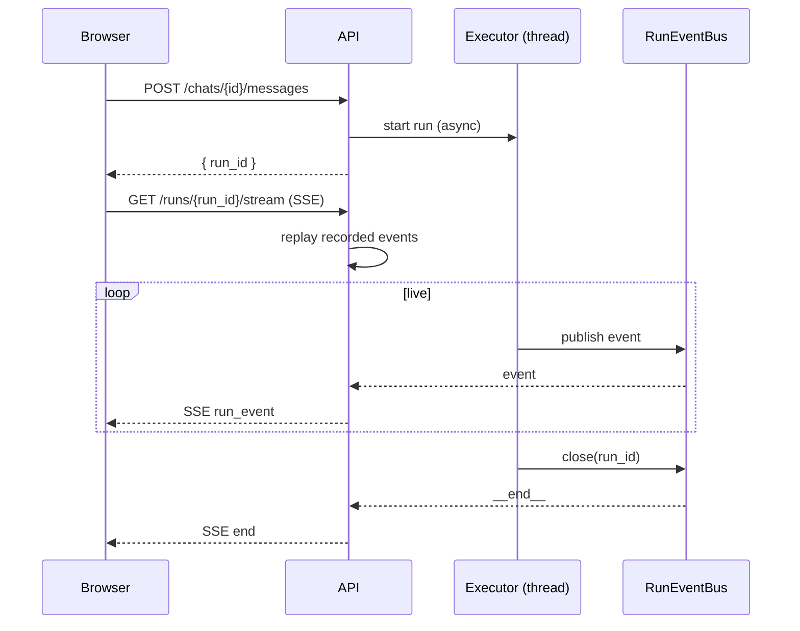
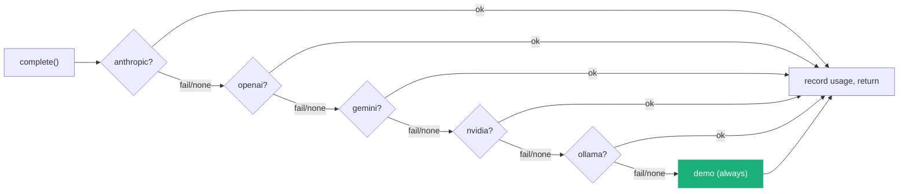
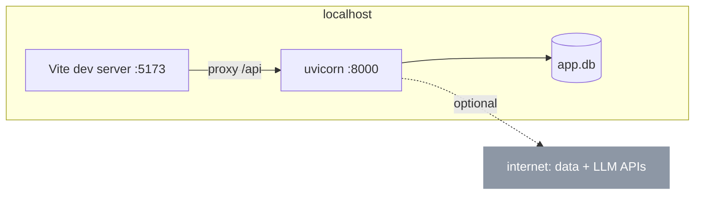

# Blueprints

Reference drawings, numbered. No argument here; the reasoning is in
[high-level-design.md](high-level-design.md) and
[low-level-design.md](low-level-design.md).

## B1. Module dependency map

Solid arrows are allowed dependencies. Dashed arrows are the edges the
architecture forbids: the frontend does not call the engine directly, tools do
not touch the database except through the context, and forecasting never calls
an LLM.

## B2. Full data model

All 12 tables. Ids are 32-character hex; timestamps are ISO strings.

`EVENT`, `TOKEN_USAGE`, and `RESOURCE_SAMPLE` link to a run by id but are not
foreign-keyed, so they survive a run's deletion for audit. `MEMORY_ITEM`,
`SERIES_CACHE`, and `APP_SETTING` are standalone.

## B3. Run status state machine

## B4. Live run request lifecycle

## B5. Provider fallback chain

Each failure records an `llm_error` event before falling through, so a run that
lands on demo still shows why every earlier provider was skipped.

## B6. Deployment topology

---

Sections: [Index](../) · [1 Why](../1-why/) · [2 Product](../2-product/) ·
**3 Architecture** · [4 Decisions](../4-decisions/) · [5 Roadmap](../5-roadmap/) ·
[6 Art of the possible](../6-art-of-the-possible/)

In this section: [Architecture](README.md) · [High-level design](high-level-design.md) ·
[Low-level design](low-level-design.md) · **Blueprints** ·
[Integration patterns](integration-patterns.md)
