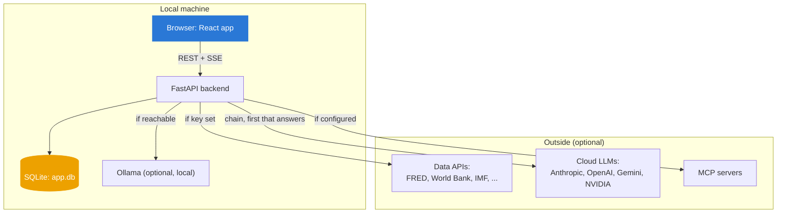
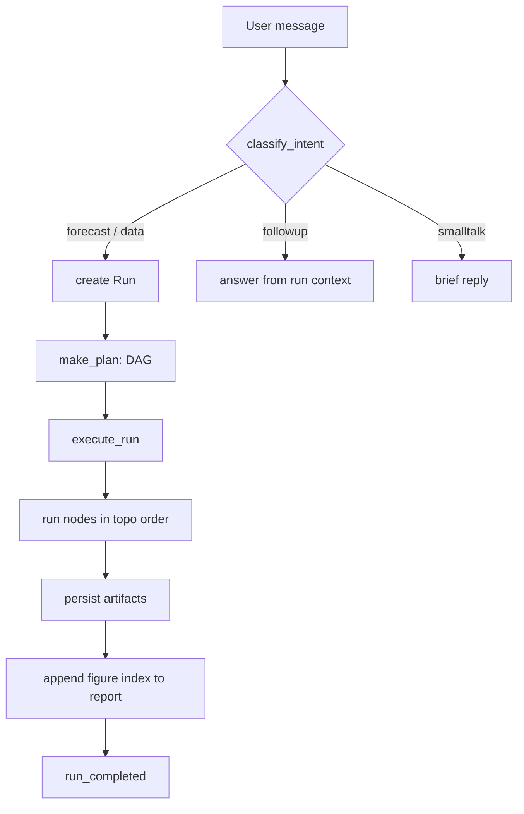
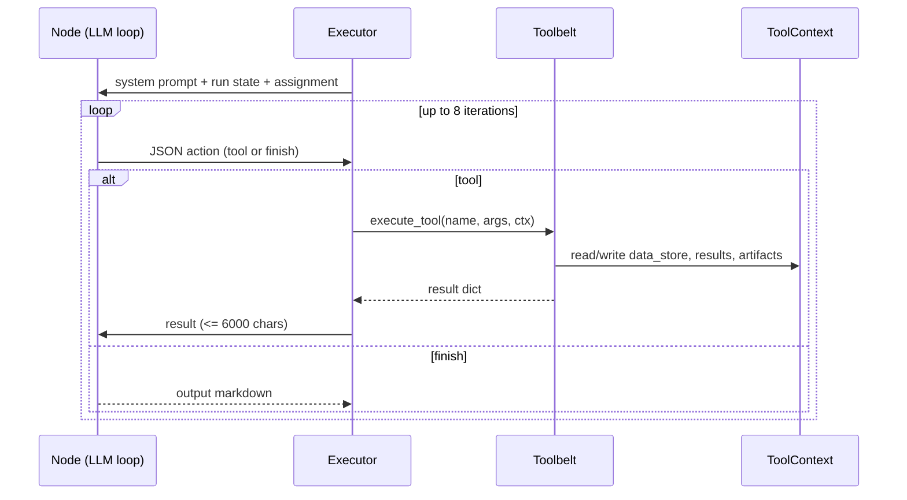
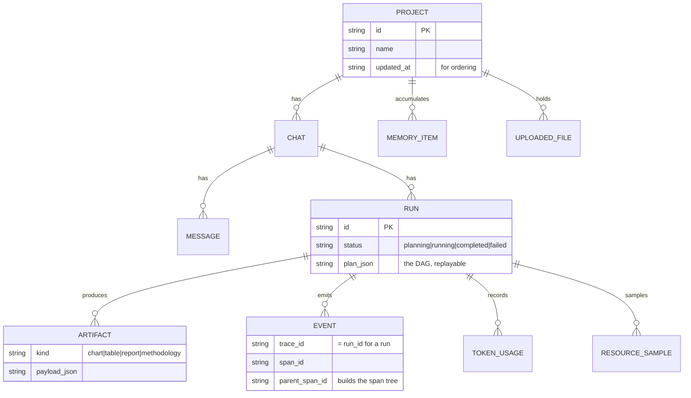

# High-level design

## Context

What runs inside the machine, what is outside it, and what is optional.

Everything outside is optional. With no cloud key and no Ollama, the backend
uses the demo provider and cached or bundled data, and a run still completes.

## Components

Each backend package, what it owns, and the rule it must not break.

| Package | Owns | Must not |
|---|---|---|
| `routers/` | HTTP endpoints, request/response shapes | Contain business logic; it delegates to pipeline and services |
| `agents/engine/` | Planner, executor, event bus, sampler | Know about specific tools; it calls them by name through the belt |
| `agents/tools/` | The 12 typed tools | Reach into the DB directly except through the context or services |
| `connectors/` | Data-source access, cache, retries | Format for a chart or a model; it returns `SeriesData` |
| `forecasting/` | The 8 models, backtests, series helpers | Fetch data or call an LLM; it takes a series and returns a result |
| `llm/` | Provider adapters, the fallback chain, cost | Know what a run is; it takes messages and returns text |
| `memory/` | The 4 memory types, backends, adapters | Be required; a run works with the SQLite default alone |

The "must not" column is the load-bearing part. It is what keeps a change in one
package from rippling into another.

## The main pipeline

The intent gate is the first fork and the one that used to fail; a data question
that missed it fell into `smalltalk` and got a tool-less answer. See
[what-goes-wrong.md](../1-why/what-goes-wrong.md#cluster-2-it-invents-the-response-instead-of-doing-the-work).

## Data flow through one node

Every node is the same loop. The model never sees raw data; it sees tool
results, truncated to 6,000 characters, plus the injected run state.

`ToolContext` is the shared state for a run: the fetched series (`data_store`),
the model results (`results`), and the artifacts. A tool reads and writes it; the
executor reads it to build the run-state block that goes into the next prompt.

## Storage

One SQLite file, 12 tables. The core relationships:

The full model, including `series_cache`, `app_settings`, and every column, is in
[blueprints.md](blueprints.md#b2).

## Transport

Two channels between browser and backend.

- **REST** for everything transactional: create a project, post a message, fetch
  a run's artifacts. Plain JSON over HTTP.
- **Server-Sent Events** for a live run. The browser opens
  `GET /api/runs/{id}/stream`; the backend replays the events already recorded,
  then streams new ones off the in-memory `RunEventBus` as they happen, ending
  with an `end` event. SSE rather than WebSockets because the flow is one-way
  (server to browser) and SSE reconnects itself.

## Deployment

Local development only. `scripts/dev.ps1` starts uvicorn on 8000 and Vite on
5173; Vite proxies `/api` to the backend. There is no container, no cloud
target, and no auth. Packaging is a [roadmap](../5-roadmap/) item, and auth is a
precondition for any networked deployment, called out as a risk in
[prd.md](../2-product/prd.md#risks).

## Quality gates

| Gate | What it checks |
|---|---|
| `pytest` (197 tests) | Every guarantee in [prd.md](../2-product/prd.md); all offline |
| `vitest` (7 tests) | The frontend store's project/chat/rename logic |
| `tsc --noEmit` | The frontend types |
| `oxlint` | The frontend lint rules |

---

Sections: [Index](../) · [1 Why](../1-why/) · [2 Product](../2-product/) ·
**3 Architecture** · [4 Decisions](../4-decisions/) · [5 Roadmap](../5-roadmap/) ·
[6 Art of the possible](../6-art-of-the-possible/)

In this section: [Architecture](README.md) · **High-level design** ·
[Low-level design](low-level-design.md) · [Blueprints](blueprints.md) ·
[Integration patterns](integration-patterns.md)
