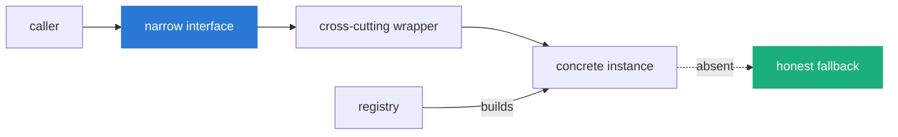

# Integration patterns

Every boundary between this system and something outside it follows one pattern.
This page extracts the pattern, then shows each integration as an instance of
it, then gives the checklist for adding the next one.

## The generic pattern

An integration is a seam with four parts.

1. **A narrow interface.** A protocol with the fewest methods the caller needs.
   The connector protocol is two methods; the LLM adapter is one.
2. **A registry that builds the instances.** One place that reads configuration
   and constructs the live objects, so the caller never constructs them.
3. **A wrapper for the cross-cutting concern.** Caching, retries, fallback,
   token accounting: the thing every instance needs and none should reimplement.
4. **A defined behaviour when it is absent.** No key, no server, no match. The
   system must do something honest, not crash and not pretend.

The value of the pattern is that the caller depends on the interface, not the
instance, so a new instance is additive. A new connector cannot break the
executor, because the executor has never heard of connectors.

## Instance: data connectors

| Part | This integration |
|---|---|
| Interface | `Connector`: `search(query, limit)`, `fetch(series_id, **params)` |
| Registry | `connectors/registry.py` builds 11 connectors from config and keys |
| Wrapper | `CachedConnector`: 24-hour SQLite cache; `request_json` retries |
| Absent | No key means the connector is not built; a missing series raises `ConnectorError` with the id format; no search match returns `[]` |

The absent behaviour here is the one that bit hardest: returning filler for an
empty match instead of nothing. See
[what-goes-wrong.md](../1-why/what-goes-wrong.md#cluster-3-a-source-returns-filler-instead-of-nothing).

## Instance: LLM providers

| Part | This integration |
|---|---|
| Interface | `LLMAdapter`: `complete(system, messages, model, json_mode)` |
| Registry | `llm/builder.py` builds the chain from provider order and keys |
| Wrapper | `LLMRegistry.complete`: walks the chain, records usage and cost, falls through on failure |
| Absent | No reachable provider falls through to the demo adapter, which always answers |

The interface is deliberately not a provider's native tool-use API. Tools are a
JSON text protocol so every adapter is interchangeable. This is the
[central decision](../4-decisions/), and the demo adapter is only possible
because of it.

## Instance: memory backends

| Part | This integration |
|---|---|
| Interface | The memory backend methods (`add`, `search`, `get_recent`) |
| Registry | `memory/integrations.py` selects a backend from settings |
| Wrapper | `MemoryService` exposes the 4 typed operations over any backend |
| Absent | The default SQLite backend is always available; Mem0/Zep need keys; 8 services are connect stubs |

## Instance: MCP servers

| Part | This integration |
|---|---|
| Interface | `mcp_list_tools` and `mcp_call_tool`, exposed to agents as tools |
| Registry | MCP server config in `app_settings`, edited via `/api/settings/mcp` |
| Wrapper | The MCP client tool handles the connection and call |
| Absent | No configured server means the tools return an error the agent can read |

MCP is the one integration that lets an agent reach a tool this project did not
write. It sits behind the same tool interface as everything else, so the
executor treats it identically.

## Instance: file uploads

| Part | This integration |
|---|---|
| Interface | The `uploads` connector, same `Connector` protocol |
| Registry | An uploaded file registers a virtual series id `fileId:column` |
| Wrapper | The same cache and context path as any connector |
| Absent | No attachment means the connector serves nothing; agents are told about attachments in the question |

A user's CSV becomes a first-class data source by satisfying the connector
protocol. Nothing downstream distinguishes an uploaded series from a FRED one.

## Checklist: adding the next integration

To add a data source, model, provider, or memory backend:

- [ ] Implement the narrow interface, and nothing more. Do not leak the
      instance's quirks past it.
- [ ] Register it in the one registry for its kind. The caller must not
      construct it.
- [ ] Reuse the wrapper. Do not reimplement caching, retries, fallback, or token
      accounting.
- [ ] Define the absent behaviour, and make it honest. No match returns nothing.
      A missing key does not crash. An error names what a valid input would be,
      because the caller may be an agent.
- [ ] Add a test that exercises the absent behaviour, not just the happy path.
      The absent path is where the real bugs were.

---

Sections: [Index](../) · [1 Why](../1-why/) · [2 Product](../2-product/) ·
**3 Architecture** · [4 Decisions](../4-decisions/) · [5 Roadmap](../5-roadmap/) ·
[6 Art of the possible](../6-art-of-the-possible/)

In this section: [Architecture](README.md) · [High-level design](high-level-design.md) ·
[Low-level design](low-level-design.md) · [Blueprints](blueprints.md) ·
**Integration patterns**
