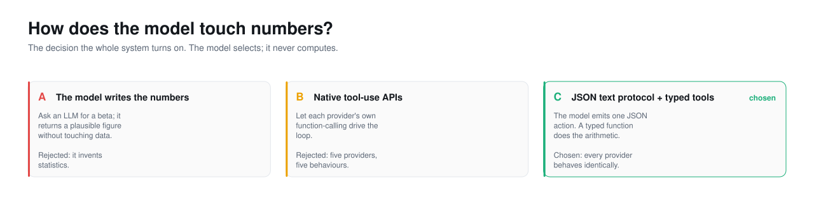

<picture>
  <source media="(prefers-color-scheme: dark)" srcset="../assets/hero-decisions-dark.svg">
  <source media="(prefers-color-scheme: light)" srcset="../assets/hero-decisions-light.svg">
  
</picture>

# Decisions

Every decision here follows four beats: the **context** that made it a question,
the **options** actually on the table, the **decision** and what it costs, and
the **evidence** behind it. The fourth beat is the one most decision logs skip,
and it is the one that lets a future reader know what would change the call.

The most useful column in the index is the last one: what reversing each choice
would cost now.

| ID | Decision | Theme | Reversible? |
|---|---|---|---|
| [D1](the-central-decision.md#d1) | Models select, typed tools compute | Central | No. It is the premise; reversing it is a different product |
| [D2](the-central-decision.md#d2) | Tools are a JSON text protocol, not native tool APIs | Central | Hard. The demo provider and provider-parity depend on it |
| [D3](mechanisms.md#d3) | Tool errors name the valid options | Mechanism | Easy, and would reintroduce the guessing failure |
| [D4](mechanisms.md#d4) | Live run state is injected into every prompt | Mechanism | Easy, and charts would silently stop appearing |
| [D5](mechanisms.md#d5) | An invalid LLM plan falls back to a template | Mechanism | Easy; runs would fail instead of degrading |
| [D6](mechanisms.md#d6) | A figure index is appended to every report | Mechanism | Easy; reports would depend on the model to cite figures |
| [D7](platform.md#d7) | SQLite for everything, no separate store | Platform | Moderate; a schema migration and a new deploy story |
| [D8](platform.md#d8) | SSE for live runs, not WebSockets | Platform | Moderate; a transport rewrite on both ends |
| [D9](platform.md#d9) | Import concrete statsmodels modules | Platform | Trivial to break, and it breaks the app on Windows |
| [D10](platform.md#d10) | TF-IDF for semantic recall, computed locally | Platform | Easy; would add an embedding dependency and cost |
| [D11](reversals.md#d11) | Connectors returned catalog filler on no match | Reversed | Already reversed; it was a bug |
| [D12](reversals.md#d12) | A provider-agnostic native tool API | Not built | Deliberately not built; see the reasoning |
| [D13](reversals.md#d13) | Keyword intent classification, not an LLM | Deferred | Chosen for now; an LLM classifier is a roadmap item |

## The themes

- **[The central decision](the-central-decision.md).** The one the whole system
  turns on, and the protocol choice that follows from it.
- **[Mechanisms](mechanisms.md).** The small decisions that make the agents
  recover instead of fail. Most were made after watching a real failure.
- **[Platform](platform.md).** The infrastructure choices, including the one
  Windows quirk that is not optional.
- **[Reversals](reversals.md).** What was undone, and what was designed and
  deliberately not built. A decision log with no reversals is a log nobody was
  honest in.

---

Sections: [Index](../) · [1 Why](../1-why/) · [2 Product](../2-product/) ·
[3 Architecture](../3-architecture/) · **4 Decisions** · [5 Roadmap](../5-roadmap/) ·
[6 Art of the possible](../6-art-of-the-possible/)

In this section: **Decisions** · [The central decision](the-central-decision.md) ·
[Mechanisms](mechanisms.md) · [Platform](platform.md) · [Reversals](reversals.md)
