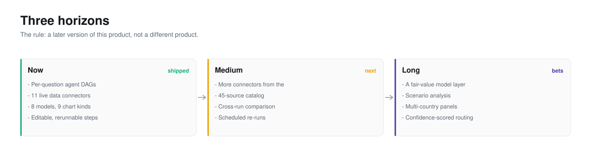
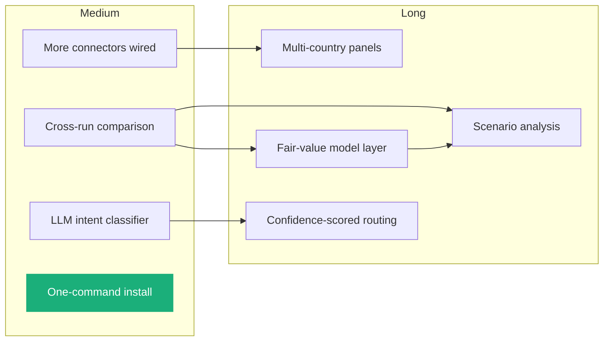

<picture>
  <source media="(prefers-color-scheme: dark)" srcset="../assets/hero-roadmap-dark.svg">
  <source media="(prefers-color-scheme: light)" srcset="../assets/hero-roadmap-light.svg">
  
</picture>

# Roadmap

## The horizons

- **Now (shipped).** Per-question agent DAGs, 11 live connectors, 8 models, 9
  chart kinds, a six-tab output panel, editable and rerunnable steps. The
  [Product](../2-product/) section covers this.
- **[Medium term](medium-term.md).** More of the catalog wired, cross-run
  comparison, an LLM intent classifier, and a one-command install.
- **[Long term](long-term.md).** A fair-value model layer, scenario analysis,
  and confidence-scored routing. These are bets, not plans.

## The rule

Every item has to pass one test: **is it a later version of this product, or a
different product?** A later version stays true to the premise from
[Decisions](../4-decisions/): the model selects, typed tools compute, and every
number traces to a tool. Anything that needs the model to compute a number
directly, or that drops traceability for speed, is a different product and does
not belong here however useful it might be.

That rule is why "let the model just estimate the forecast" is not on this
roadmap, and "a typed fair-value tool the model can call" is.

## From medium term to long term

Each long-term bet depends on medium-term work existing first.

A fair-value model layer needs cross-run comparison to evaluate it. Scenario
analysis needs both. Confidence-scored routing needs the classifier that the
medium term introduces. The install work is a leaf: nothing depends on it, but
adoption does.

---

Sections: [Index](../) · [1 Why](../1-why/) · [2 Product](../2-product/) ·
[3 Architecture](../3-architecture/) · [4 Decisions](../4-decisions/) ·
**5 Roadmap** · [6 Art of the possible](../6-art-of-the-possible/)

In this section: **Roadmap** · [Medium term](medium-term.md) ·
[Long term](long-term.md)
