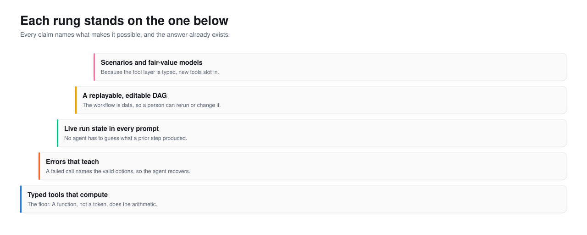
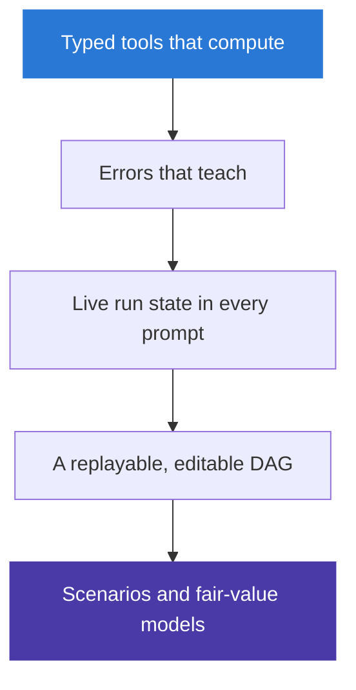

<picture>
  <source media="(prefers-color-scheme: dark)" srcset="../assets/hero-ladder-dark.svg">
  <source media="(prefers-color-scheme: light)" srcset="../assets/hero-ladder-light.svg">
  
</picture>

# The art of the possible

This is the speculative section, and speculation is where documentation usually
stops being honest. So it carries a rule, and the rule is on the page:

> **Every claim here must name what makes it possible, and the answer has to be
> something that already exists in the code.**

No "imagine if". If a capability cannot be traced to a mechanism that is already
built, it does not go on this page.

## The ladder

Each rung is reachable only because of the one below it. Read from the bottom.

- **Typed tools that compute** is the floor. A function, not a token, does the
  arithmetic. Everything else stands on this.
- **Errors that teach** is reachable because tools are typed: a typed failure can
  name the valid inputs. A free-text model could not.
- **Live run state in every prompt** is reachable because the tools write to a
  shared context the executor can read. The state exists to be injected.
- **A replayable, editable DAG** is reachable because the plan is data. A stored
  plan can be replayed; an edited plan can be rerun.
- **Scenarios and fair-value models** are reachable because the tool layer is
  typed: a new tool slots in without the model learning to compute.

## What becomes possible

Each of these is one rung up from something built.

| Possible | What makes it possible (exists now) | What changes | Roadmap |
|---|---|---|---|
| Rerun a run with a different model | The plan is stored data; `rerun` replays it | A user overrides one step and compares | [shipped](../2-product/journeys.md) |
| Compare two runs side by side | Every run stores its own artifacts and trace | "Is this better than last time" gets an answer | [medium](../5-roadmap/medium-term.md) |
| A fair-value tool the model calls | The tool seam takes a new typed function | The model anchors a forecast without computing it | [long](../5-roadmap/long-term.md) |
| Scenario overrides through the same tools | Tools take typed inputs the caller sets | Conditional forecasts, still traceable | [long](../5-roadmap/long-term.md) |
| An agent using a tool this project did not write | MCP sits behind the same tool interface | External capabilities join without a code change | [shipped](../2-product/capabilities.md) |

None of these needs the model to gain a new ability. Each needs a new typed tool
or a new view over data that already exists. That is the whole point of the
floor rung.

## What the pattern generalises to

The pattern is not about forecasting. It is: **let a language model plan and
select, and put every irreversible or checkable action behind a typed tool whose
errors teach.** Forecasting is one instance because its ground truth is cheap and
its failures are visible.

A domain can use this pattern when it meets three conditions.

1. **The actions decompose into a small set of typed operations.** Here: search,
   fetch, model, chart. If the work cannot be expressed as a handful of typed
   functions, there is nothing for the model to select among.
2. **The outputs are checkable.** Here: a forecast has a backtest, a coefficient
   has a bound. If a wrong answer is indistinguishable from a right one, the
   typed tool cannot catch the invented result.
3. **The ground truth is reachable.** Here: public, free economic series. If the
   real data is expensive or absent, the model has nothing to be grounded
   against, and it will fill the gap with plausible text, which is the failure
   this whole design exists to prevent.

Legal research, medical coding, financial reporting, scientific data analysis:
each meets the three conditions to some degree, and each has the same failure
mode this project started from, the confident wrong number. The mechanism that
closes it is the same. Typed tools that compute. Errors that teach. State the
agent can see. A plan that is data.

---

Sections: [Index](../) · [1 Why](../1-why/) · [2 Product](../2-product/) ·
[3 Architecture](../3-architecture/) · [4 Decisions](../4-decisions/) ·
[5 Roadmap](../5-roadmap/) · **6 Art of the possible**
