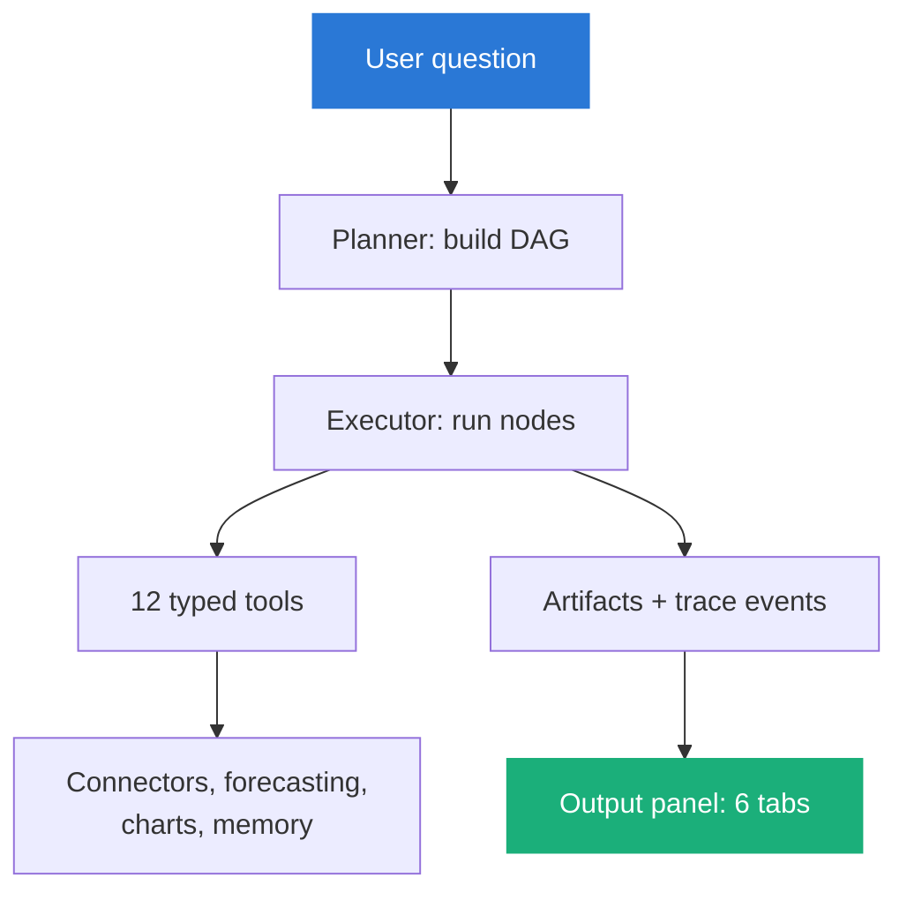

# Documentation

Six sections. Each is a directory with a landing page, so nesting is real
navigation rather than anchors on one long page.

| # | Section | For | The question it answers |
|---|---|---|---|
| 1 | [Why](1-why/) | Anyone deciding whether to look | What actually goes wrong, and why this is a product not a prompt |
| 2 | [Product](2-product/) | Product owners, new users | What it does, what it guarantees, what it refuses |
| 3 | [Architecture](3-architecture/) | Engineers | The layers, the seams, and the constraints that are not obvious |
| 4 | [Decisions](4-decisions/) | Engineers, reviewers | Why it is built this way, and what reversing each choice would cost |
| 5 | [Roadmap](5-roadmap/) | Contributors, planners | What ships next, and what is a bet |
| 6 | [Art of the possible](6-art-of-the-possible/) | The curious | What this pattern makes reachable |

## The short version

A user asks a forecasting question in a project chat. A planner language model
reads the question and composes a workflow: a directed acyclic graph of
specialist agent nodes, each with a role and a small set of allowed tools. The
executor runs that graph, and every node is itself a language model loop that
picks one tool at a time, inspects the result, and either calls another tool or
finishes. The tools are 12 typed Python functions: they search and fetch real
economic series, run one of 8 forecasting models, build one of 9 chart kinds,
and read and write memory. The model decides what to do; the functions do it.

The output is not a paragraph. It is an output panel with six tabs. Charts and
Data hold the figures. Report holds the narrative, with each figure cited
inline. Method documents what the run actually did: which series, which models,
how they backtested. Steps shows the workflow DAG and lets you edit an
instruction and rerun it. Trace is every tool call and argument, as a span
tree. The point is that a reader can get from the headline number back to the
raw observation it came from, in six clicks or fewer.

None of this needs a cloud key. The provider chain tries Anthropic, OpenAI,
Gemini, NVIDIA, and local Ollama in order, and if none is reachable a
deterministic demo provider drives the same workflow to a real ARIMA forecast
from World Bank data, clearly labelled. That fallback exists because the value
being demonstrated is the traceable pipeline, and the pipeline should be
inspectable with nothing installed.

## Sources of truth

When this documentation and the code disagree, the code wins. These are the
places to check.

| Source | What it is authoritative for |
|---|---|
| `backend/tests/` (197 tests) | What the system actually guarantees |
| `backend/app/agents/engine/roles.py` | The six agent roles and their allowed tools |
| `backend/app/agents/tools/` | The 12 tools and their input schemas |
| `backend/app/forecasting/registry.py` | The 8 models |
| `backend/app/connectors/registry.py` | The 11 wired connectors |
| `backend/app/models.py` | The 12 database tables |
| `docs/plans/` | The original design and plan (internal notes, not reader-facing) |

---

Sections: **Index** · [1 Why](1-why/) · [2 Product](2-product/) ·
[3 Architecture](3-architecture/) · [4 Decisions](4-decisions/) ·
[5 Roadmap](5-roadmap/) · [6 Art of the possible](6-art-of-the-possible/)
